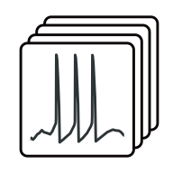

<p align="center">
  
</p>

# Conductance-based neuron dataset generator

Python toolkit for simulating large populations of conductance-based neuron models and collecting their **spike trains**. Two neuron models are included: the STG (stomatogastric ganglion) neuron and the DA (midbrain dopamine) neuron. Simulations support multiprocessing and optional noisy current injection.

## Repository structure

```
code/
  utils.py                       # shared utilities (gating helpers, spike detection, DICs tools)
  merge_chunks.py                # shared chunk-merging script
  split_dataset.py               # shared train/val split script
  stg_liu/
    stg.py                       # STG neuron model and DICs framework
    generate_conductances_MC.py  # conductance sampling (Monte Carlo)
    generate_conductances_DICs.py# conductance sampling (DICs framework)
    simulate_dataset.py          # parallel simulation → spike trains
  da_qian/
    da.py                        # DA neuron model and DICs framework
    generate_conductances_MC.py
    generate_conductances_DICs.py
    simulate_dataset.py
```

## Models

| Folder | Neuron | Ion channels |
|--------|--------|-------------|
| `code/stg_liu/` | STG neuron | Na, Kd, CaT, CaS, KCa, A, H, leak |
| `code/da_qian/` | DA neuron  | Na, Kd, CaL, CaN, ERG, NMDA, leak |

**STG model:** Liu, Z. et al. *A model neuron with activity-dependent conductances regulated by multiple calcium sensors.* J. Neurosci. 18(7):2309–20, 1998. [doi:10.1523/JNEUROSCI.18-07-02309.1998](https://doi.org/10.1523/JNEUROSCI.18-07-02309.1998)

**DA model:** Qian, K. et al. *Mathematical analysis of depolarization block mediated by slow inactivation of fast sodium channels in midbrain dopamine neurons.* J. Neurophysiol. 112(11):2779–90, 2014. [doi:10.1152/jn.00578.2014](https://doi.org/10.1152/jn.00578.2014)

## Conductance Sampling

Conductance sets can be generated by two strategies:

- **Monte Carlo (`generate_conductances_MC.py`)** - independent sampling of each maximal conductance from a uniform or gamma distribution over biologically plausible ranges.
- **DICs framework (`generate_conductances_DICs.py`)** - sampling guided by Dynamic Input Conductances to generate **degenerate populations**: groups of neurons that exhibit the same activity pattern despite having widely different individual conductance values. See:
See: foundational and recent work on Dynamic Input Conductances (DICs) and related dimensionality-reduction approaches:
    - Drion G. et al. *Dynamic Input Conductances Shape Neuronal Spiking.* eNeuro 2(1), 2015. [doi:10.1523/ENEURO.0031-14.2015](https://doi.org/10.1523/ENEURO.0031-14.2015)  
    - Fyon A. et al. *Dimensionality reduction of neuronal degeneracy reveals two interfering physiological mechanisms.* PNAS Nexus, 3(10), pgae415, Oct 2024. [doi:10.1093/pnasnexus/pgae415](https://doi.org/10.1093/pnasnexus/pgae415)  
    - Brandoit J. et al. *Fast reconstruction of degenerate populations of conductance-based neuron models from spike times.* arXiv:2509.12783, 2025. [https://arxiv.org/abs/2509.12783](https://arxiv.org/abs/2509.12783)

## Outputs

Simulations produce **spike trains** (lists of spike times), not full voltage traces. Results are saved as CSV files.

## Pipeline

Each model folder contains a 3- or 4-step pipeline:

```
Step 1 – Generate conductances      generate_conductances_MC.py  or  generate_conductances_DICs.py
Step 2 – Simulate in parallel       simulate_dataset.py
Step 3 – Merge chunk outputs        merge_chunks.py
Step 4 – Split dataset              split_dataset.py
```

### Running Step 2 on an HPC cluster (Slurm)

`simulate_dataset.py` accepts `--chunk_id` and `--total_chunks` so that each Slurm array task processes a disjoint slice of the conductance CSV. Map `$SLURM_ARRAY_TASK_ID` directly to `--chunk_id` and `$SLURM_ARRAY_TASK_COUNT` to `--total_chunks`:

```bash
#!/usr/bin/env bash
#SBATCH --job-name=simulate
#SBATCH --output=logs/simulate_%A_%a.out
#SBATCH --array=0-199          # 200 tasks → 200 chunks
#SBATCH --cpus-per-task=16
#SBATCH --mem-per-cpu=2G
#SBATCH --time=12:00:00

# [... MODULE LOADING / CONDA ACTIVATION HERE ...]

python simulate_dataset.py \
  --input_file conductances.csv \
  --output_dir chunks \
  --chunk_id    ${SLURM_ARRAY_TASK_ID} \
  --total_chunks ${SLURM_ARRAY_TASK_COUNT} \
  --n_workers   ${SLURM_CPUS_PER_TASK} \
  --ode_type noisy \
  --sigma_noise 3.0 \
  --cutoff_freq 1000.0
```

Once all array tasks have completed, merge the chunks (run from the model folder):

```bash
python ../merge_chunks.py --input_dir chunks --output_file dataset.csv
```

## Noisy Current Injection

Pass `--ode_type noisy` to `simulate_dataset.py` to inject band-limited Gaussian noise during simulation:

```bash
python simulate_dataset.py \
  --input_file dataset_conductances.csv \
  --output_dir chunks \
  --chunk_id 0 \
  --total_chunks 1 \
  --ode_type noisy \
  --sigma_noise 3.0 \
  --cutoff_freq 1000.0
```

## Multiprocessing

`simulate_dataset.py` uses Python's `multiprocessing.Pool`. Control parallelism with `--n_workers`:

```bash
python simulate_dataset.py --n_workers 16 ...
```

Conductance generation scripts use `concurrent.futures.ProcessPoolExecutor` and expose `--max_workers`.

## Dependencies

```
numpy scipy pandas tqdm
```

Install with:

```bash
pip install numpy scipy pandas tqdm
```

## Quick Start

```bash
# ── STG (Liu et al.) ────────────────────────────────────────────────────────

cd code/stg_liu

python generate_conductances_MC.py --P 8 --output_file conductances.csv

python simulate_dataset.py \
  --input_file conductances.csv \
  --output_dir chunks \
  --chunk_id 0 --total_chunks 1 \
  --n_workers 16

python ../merge_chunks.py --input_dir chunks --output_file dataset.csv

python ../split_dataset.py --input_file dataset.csv


# ── DA (Qian et al.) ────────────────────────────────────────────────────────

cd ../da_qian

python generate_conductances_MC.py --P 8 --output_file conductances.csv

python simulate_dataset.py \
  --input_file conductances.csv \
  --output_dir chunks \
  --chunk_id 0 --total_chunks 1 \
  --n_workers 16

python ../merge_chunks.py --input_dir chunks --output_file dataset.csv

python ../split_dataset.py --input_file dataset.csv
```

## Pre-generated Datasets

Ready-to-use spike-train datasets produced with this toolkit are publicly available on Zenodo:

> Brandoit, J., Ernst, D., Drion, G., & Fyon, A. (2025). *Spike-Train Datasets from Conductance-Based Neuron Models* [Data set]. Zenodo. [https://doi.org/10.5281/zenodo.16912161](https://doi.org/10.5281/zenodo.16912161)

If you use one of the pre-generated datasets in your work, please cite the data record above.

### Dataset versions

| Version | Release date | Neuron models | Sampling strategy | Notes |
|---------|-------------|---------------|-------------------|-------|
| v1.0 | 2025 | STG (Liu et al.), DA (Qian et al.) | Monte Carlo & DICs | Early release, poorly documented - superseded by v2.0 |
| v2.0 | 2025 | STG (Liu et al.), DA (Qian et al.) | Monte Carlo & DICs | Current release - 6 datasets |

> New dataset releases will be listed here as new versions become available on Zenodo.

For a detailed description of each individual dataset (ion channels, DICs parameters, simulation window, noise settings, and available splits), see [`data/data_table.md`](data/data_table.md).

## Citation

This software is released under the MIT License. If you use it in your research, attribution is welcome. Please cite:

```bibtex
@misc{brandoit2025fast,
  title        = {Fast reconstruction of degenerate populations of conductance-based neuron models from spike times},
  author       = {Brandoit, Julien and Ernst, Damien and Drion, Guillaume and Fyon, Arthur},
  year         = {2025},
  eprint       = {2509.12783},
  archivePrefix = {arXiv},
  primaryClass = {q-bio.NC},
  url          = {https://arxiv.org/abs/2509.12783}
}
```

If you use a **pre-generated dataset**, please also cite the data record:

```bibtex
@dataset{brandoit2025dataset,
  author    = {Brandoit, Julien and Ernst, Damien and Drion, Guillaume and Fyon, Arthur},
  title     = {Spike-Train Datasets from Conductance-Based Neuron Models},
  year      = {2025},
  publisher = {Zenodo},
  doi       = {10.5281/zenodo.16912160},
  url       = {https://doi.org/10.5281/zenodo.16912160}
}
```

## License

MIT - see [`LICENSE`](LICENSE).
